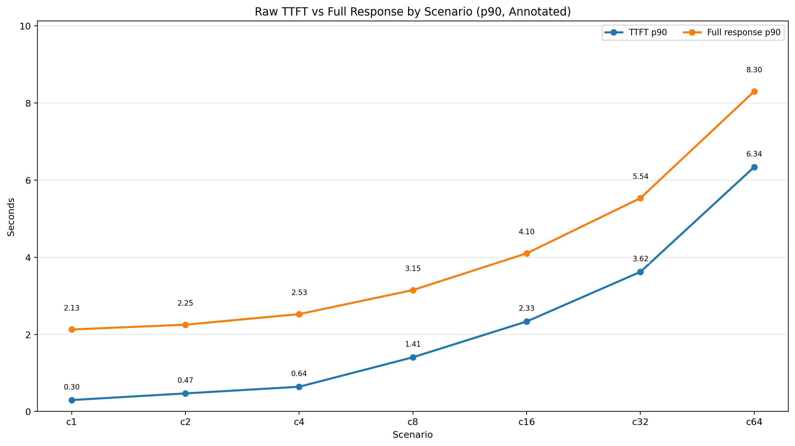
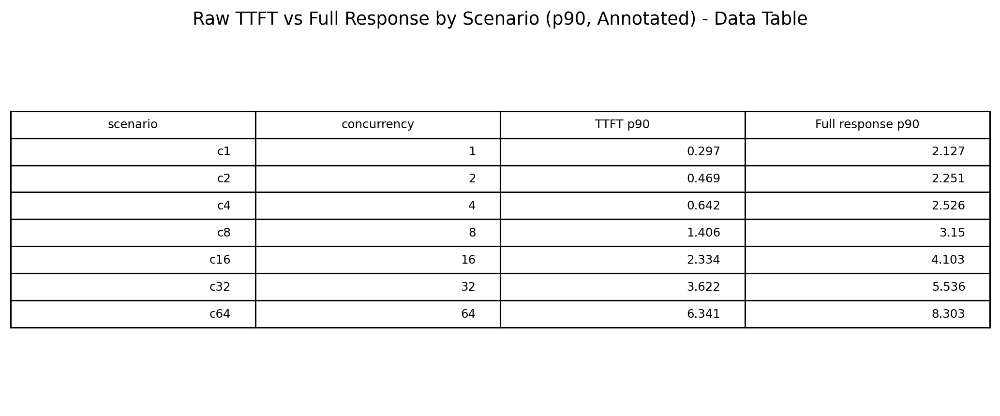
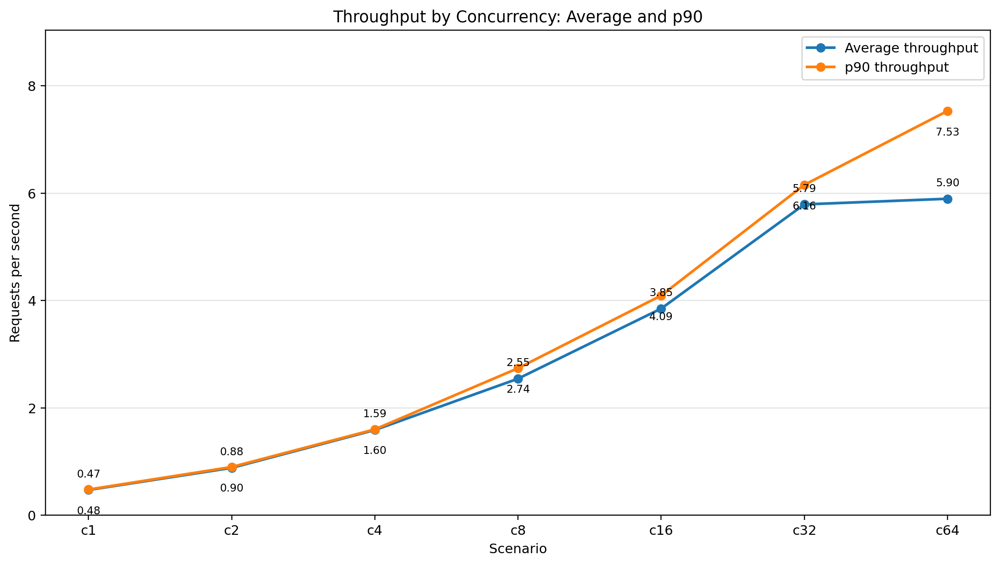
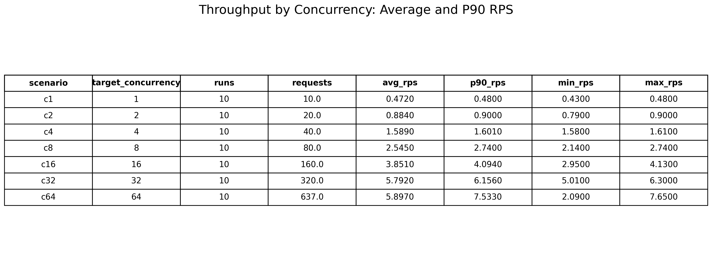
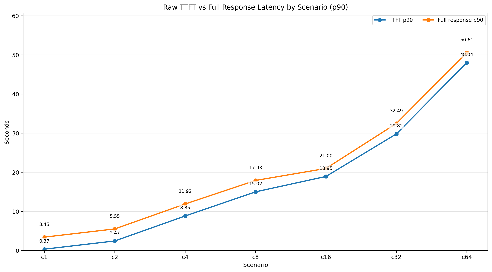
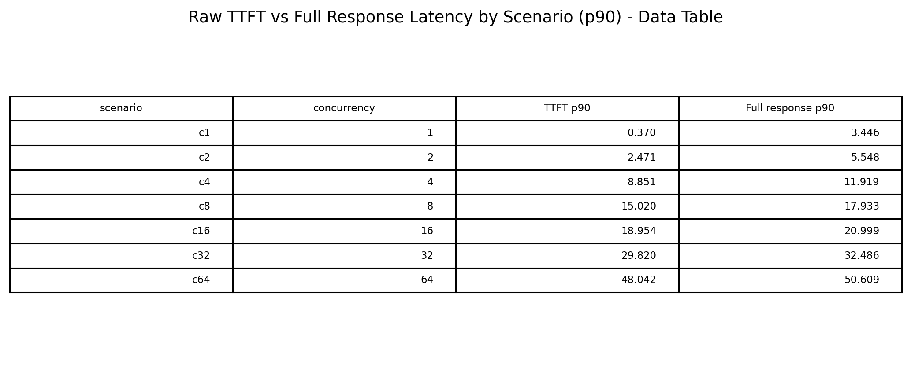
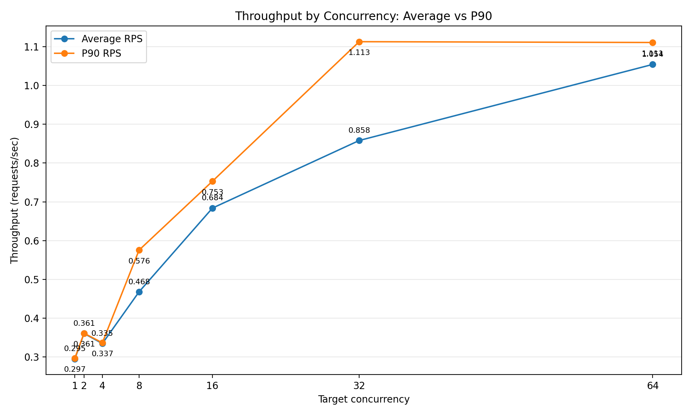
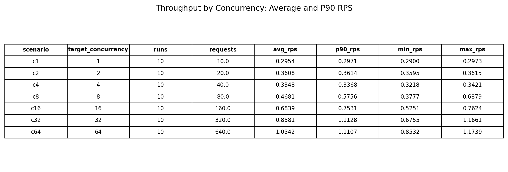

# MedGemma SageMaker Real-Time Benchmark Results

These benchmark results summarize latency and throughput behavior for MedGemma
running on Amazon SageMaker real-time inference endpoints backed by G6e and G7e
instances. Each scenario increases target concurrency from `c1` through `c64`
to show how the endpoint behaves under progressively higher request load.

## Executive Summary

For SageMaker real-time inference, G7e delivers substantially stronger
performance in these benchmark runs. At the representative `c8` concurrency
scenario, the G7e endpoint reaches about 2.55 average requests per second with
a 3.15 second p90 full-response latency. In the same scenario, the G6e endpoint
reaches about 0.47 average requests per second with a 17.93 second p90
full-response latency.

| SageMaker endpoint instance | c8 avg throughput | c8 p90 throughput | c8 p90 TTFT | c8 p90 full response |
| --- | ---: | ---: | ---: | ---: |
| G6e | 0.47 RPS | 0.58 RPS | 15.02s | 17.93s |
| G7e | 2.55 RPS | 2.74 RPS | 1.41s | 3.15s |

## Metrics

- **TTFT p90**: 90th percentile time to first token.
- **Full response p90**: 90th percentile latency for the complete response.
- **Average RPS**: Average endpoint requests completed per second.
- **p90 RPS**: 90th percentile observed endpoint throughput across benchmark runs.

## G7e Results

### Latency by Concurrency

The G7e SageMaker real-time endpoint keeps both p90 TTFT and p90 full-response
latency low as concurrency increases. At `c64`, p90 TTFT is 6.34 seconds and
p90 full-response latency is 8.30 seconds.

### Latency Data

The table below lists the p90 TTFT and p90 full-response latency values used in
the G7e latency chart.

### Throughput by Concurrency

G7e endpoint throughput scales strongly as concurrency rises, reaching 5.90
average RPS and 7.53 p90 RPS at `c64`.

### Throughput Data

The table below lists the run count, request count, average RPS, p90 RPS,
minimum RPS, and maximum RPS for each G7e concurrency scenario.

## G6e Results

### Latency by Concurrency

The G6e SageMaker real-time endpoint shows higher latency as concurrency
increases. At `c64`, p90 TTFT is 48.04 seconds and p90 full-response latency is
50.61 seconds.

### Latency Data

The table below lists the p90 TTFT and p90 full-response latency values used in
the G6e latency chart.

### Throughput by Concurrency

G6e endpoint throughput increases with concurrency and reaches 1.05 average RPS
and 1.11 p90 RPS at `c64`.

### Throughput Data

The table below lists the run count, request count, average RPS, p90 RPS,
minimum RPS, and maximum RPS for each G6e concurrency scenario.

